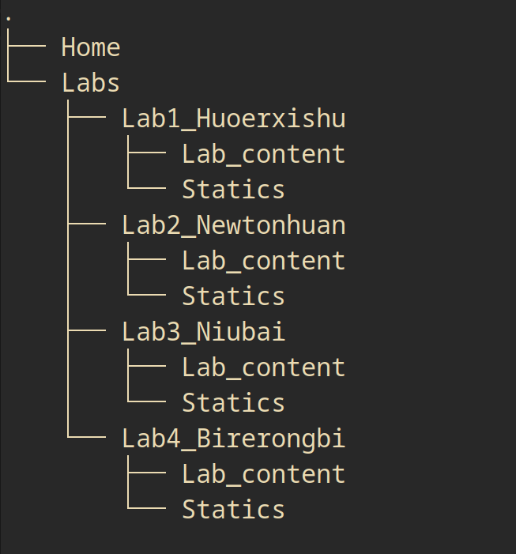

# 杭电大学物理实验辅助计算工具
 
## 项目由来

本人在进行大学物理实验的数据处理过程中，非常的头疼，因为计算器无法像程序一样接受一个参数然后按照你给定的步骤得出结果，每次必须告诉它完整的计算步骤，非常麻烦，而编写程序又需要带上电脑，不太方便，于是便想着做一个线上的网站辅助处理实验数据。

## 项目简介

网站主要分为两大模块，主页和实验页面

主页包含了 
- 基本的信息说明  
- 各个实验模块入口 
- 导航栏

实验模块则包含了
- 数据表格处理区域
- 基本的实验说明或者资源链接 方便理解实验内容

## 未来实现的功能

### 核心功能

1. 提供数据处理能力
2. 提供课程资源帮助同学们更好的理解实验内容

### 前端相关功能

1. 响应式设计， 切换为手机或小屏浏览时，改变导航栏样式（横转竖），改变卡片排列方式
2. 数据持久化， 将生成的数据存储到用户本地，刷新和重新打开页面不会造成数据丢失

## 如何实现这些功能

针对数据处理功能：
- 使用Js脚本处理数据， Js中的数字精度为14位，数值范围为2的2047次，而大学物理实验中的数据有效位数一般都是个位级别，可以满足实验精度需求，数值范围也完全不会超出。

针对响应式设计：
- 使用css @media以及其他技巧 实现不同视口宽度的样式变化

针对数据持久化：
- 使用Js中的LocalStroage以及其他技巧 实现数据存储

项目链接 --- [Preview](https://kiameow.github.io/hdu_web_frontend_final_lab/)